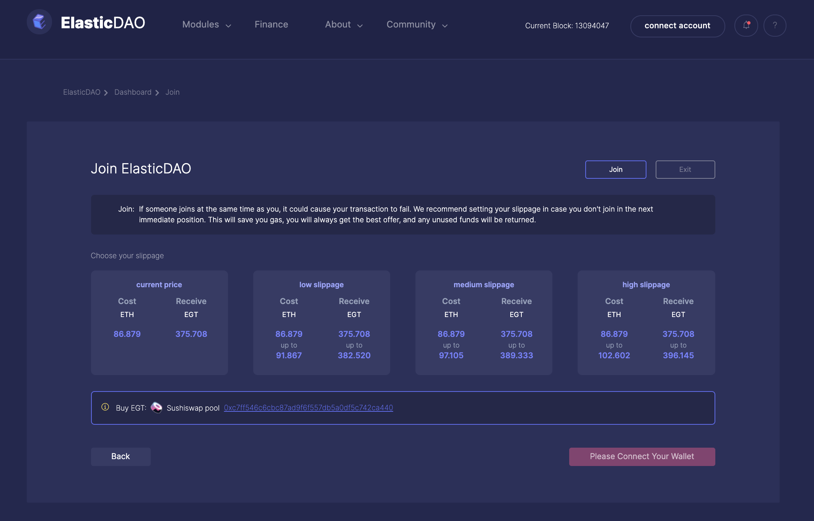
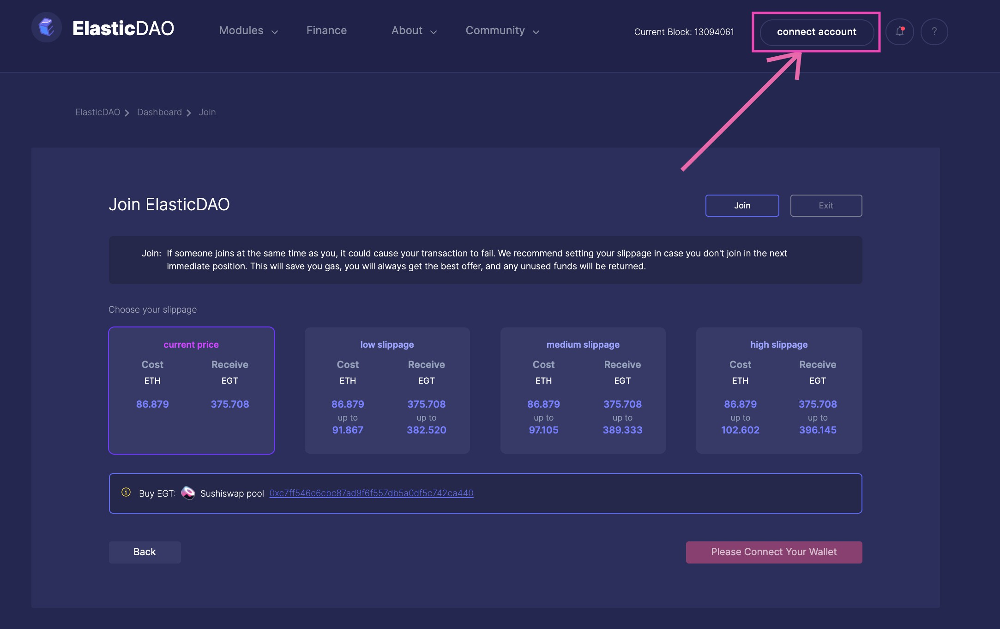
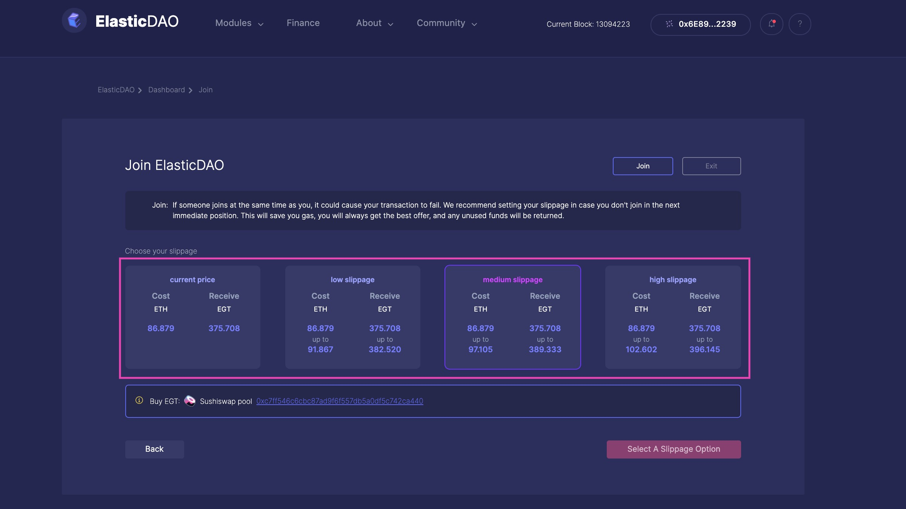
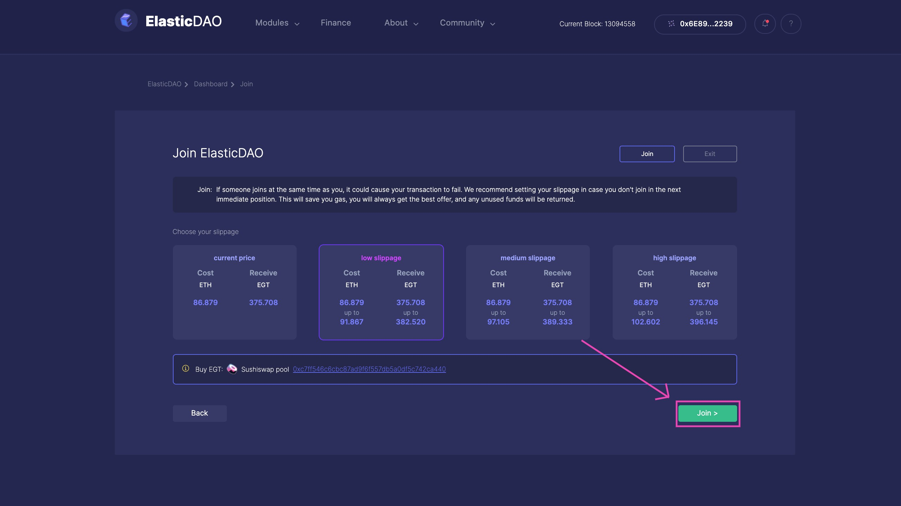
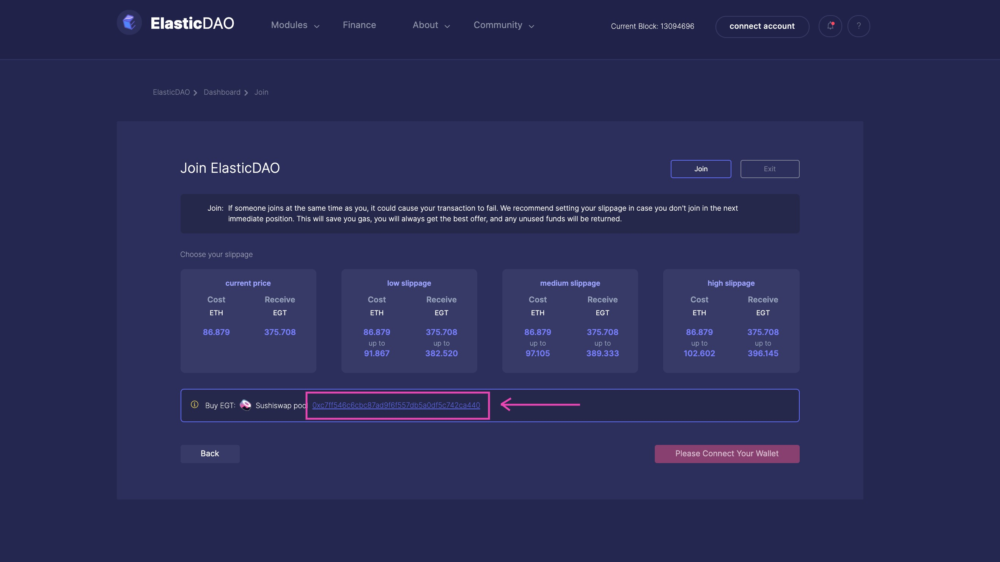
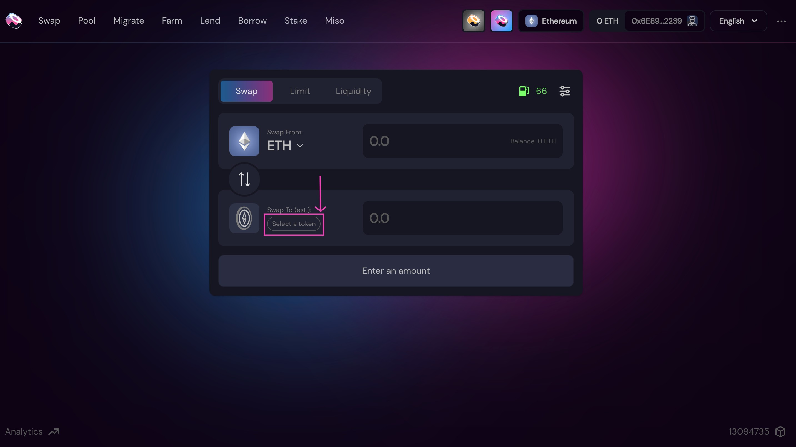
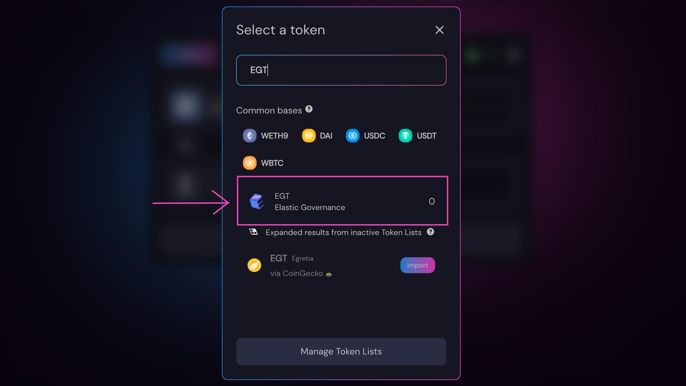
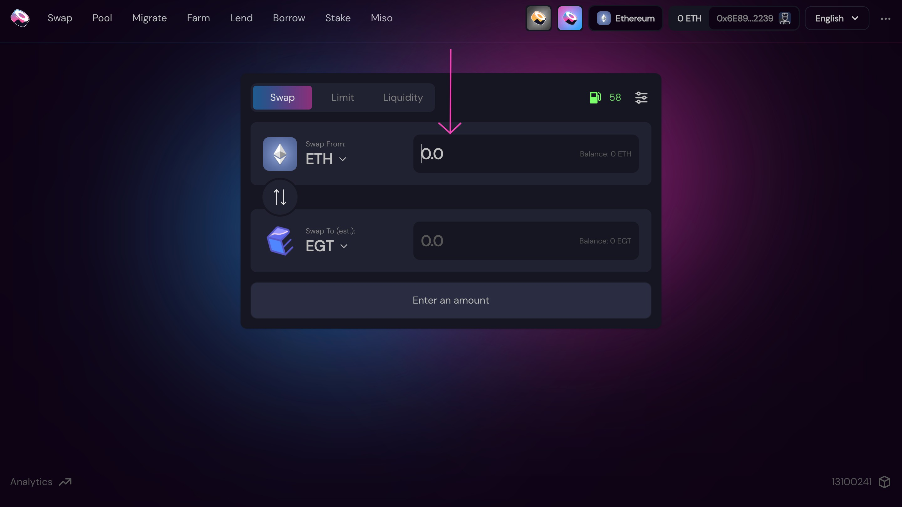
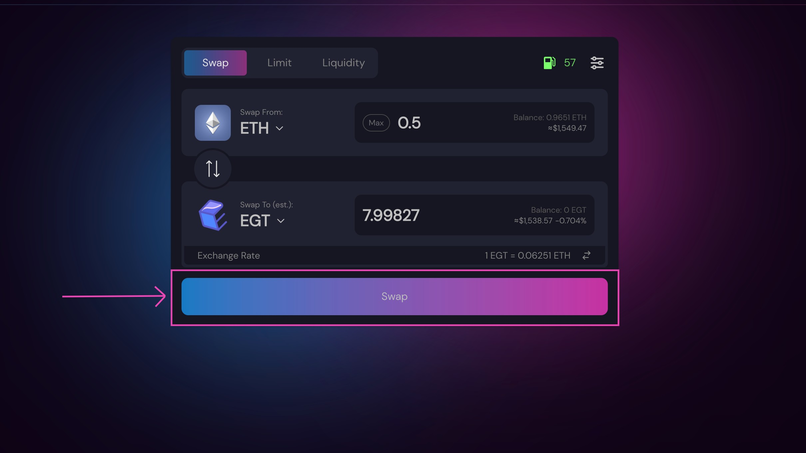
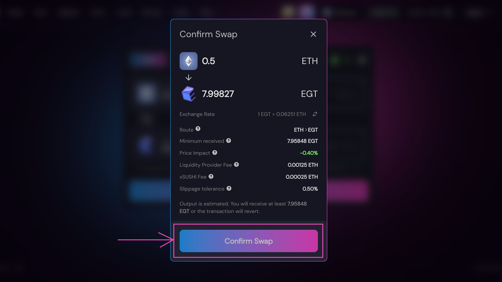

# Enter the DAO

There are mainly two ways to enter and become a member of ElasticDAO. 

The first one is to either call the [Join](https://docs.elasticdao.org/contracts/elasticdao.sol#joindao) function directly from the `ElasticDAO.sol` contract, the address of which can be found at the [Addresses](https://docs.elasticdao.org/addresses) page, or use the ElasticDAO V2 app \( which abstracts away the call to the Join function with a neat GUI \). 

The second is to obtain EGT from [SushiSwap](https://app.sushi.com/swap/0x2aa5ce395b00cc486159adbdd97c55b535cf2cf9).

Both are ways to obtain EGT, which makes you a member of ElasticDAO and allows the holder to participate in the governance of ElasticDAO

#### To enter ElasticDAO using the app:

* Navigate to the Join page: [http://elasticdao.org/\#/elasticdao.eth/join](http://elasticdao.org/#/elasticdao.eth/join) \(not a live link until V2 launches\)

* Connect your web3 wallet to the app \(if it is not already connected\), by clicking on `connect account` button on the top right hand side of the page.

* After connecting your wallet to the app, now you have to choose one suitable slippage option from the options present.

 


Presence of the various slippage options is due to the fact that the joins occur on a bonding curve, as a result of which after every successfull join transaction, the ETH required to mint maxLambdaPurchase amount of tokens increases. 

Depending on the volatility of the DAO and gas fluctuations, it might not be possible to obtain the exact EGT for it's quoted ETH amount. 

Hence the slippage options are present to account for this variability.  
  
\(More information regarding the bonding curve dynamics and tokenomics can be found at [Elastic Governance Token page](https://docs.elasticdao.org/start-with/elastic-governance-token) or at the ElasticSimulator\)


* After selecting a suitable slippage option, click on the `Join` button in the bottom right corner, which will then ask you to sign the transaction, after the completion of which you should have recieved your EGT in your wallet, making you a member of ElasticDAO!

#### To enter ElasticDAO using Sushiswap:

* Click on the Sushiswap pool link present at the bottom of the Join page


There are other places in the app where the link to Sushiswap is presented, the process is the same regardless of where the link  is clicked.


* Connect your web3 wallet with the Sushiswap app then choose EGT as the token you'd like to obtain

* Enter the amount of EGT you'd like to obtain

* Click the Swap button, after which you will be prompted to confirm the swap

*  Click on the `Confirm swap` button once you are ready. After the completetion of which, you shall now have obtained EGT, making you the a member of ElasticDAO!


* Sushiswap will show you various information regarding the swap, the details of which can be seen by hovering over their respective tooltips.


