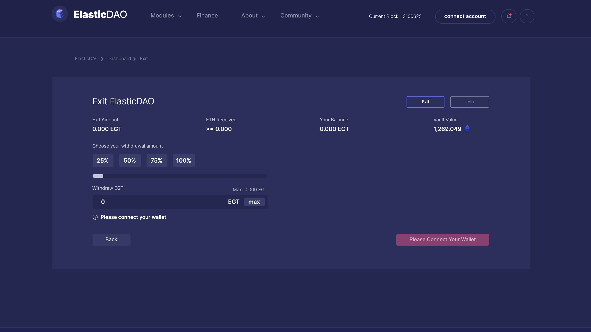
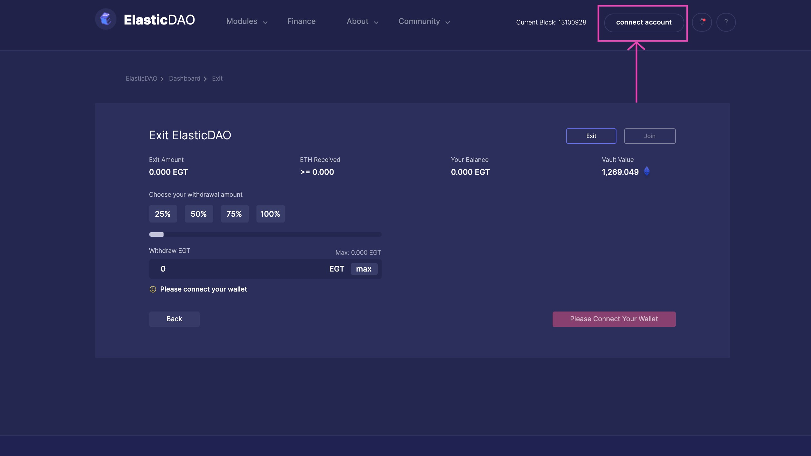
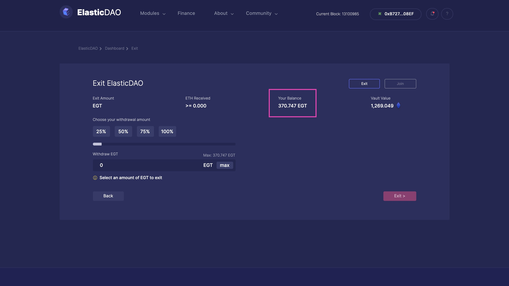

# Exit the DAO

There are mainly two ways to exit ElasticDAO 

The first one is to either call the Exit function\(link\) directly from the `ElasticDAO.sol` contract, the address of which can be found at the [Addresses](https://docs.elasticdao.org/addresses) page, or use the ElasticDAO V2 app \( which abstracts away the call to the Exit function with a neat GUI \). 

The second is to swap EGT for ETH from [SushiSwap](https://app.sushi.com/swap/0x2aa5ce395b00cc486159adbdd97c55b535cf2cf9).

#### To exit using the app:

Navigate to the Exit page: [http://elasticdao.org/\#/elasticdao.eth/exit](http://elasticdao.org/#/elasticdao.eth/exit) \(not a live link until V2 launches\)

Connect your wallet to the app \(If it is not already connected \)

Once connected, you can now see the balance of your EGT under the Your Balance section. This is the maximum amount of EGT you can exit the DAO with

You can now choose the amount of EGT you'd like to exit with. This can be done in multiple ways. By choosing a percentage \(25, 50, 75, 100\), or using the slider, or last but not the least, by typing out the exact amount you'd like to exit with.

