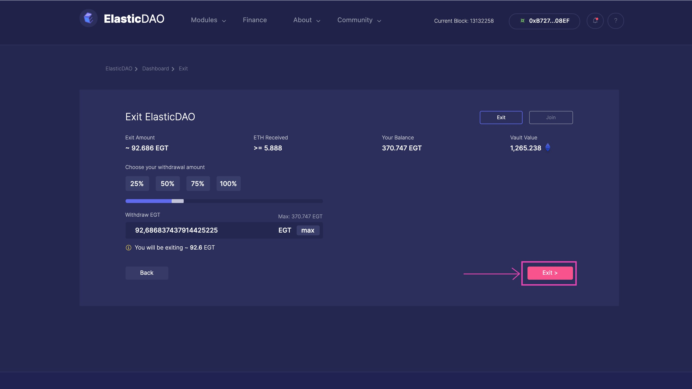

# Exit the DAO

There are mainly two ways to exit ElasticDAO 

The first one is to use the ElasticDAO V2 app. The second is to swap EGT for ETH from [SushiSwap](https://app.sushi.com/swap/0x2aa5ce395b00cc486159adbdd97c55b535cf2cf9).


Regardless of where you obtained your EGT from, you can exit ElasticDAO using either method.


#### To exit using the app:

* Navigate to the Exit page: [http://elasticdao.org/\#/elasticdao.eth/exit](http://elasticdao.org/#/elasticdao.eth/exit) \(not a live link until V2 launches\)

* Connect your wallet to the app \(if it is not already connected\) by clicking on `connect account` 

* Once connected, you can now see the current balance of your EGT under the`Your Balance`section. This is the maximum amount of EGT you can exit the DAO with.

* You can now choose the amount of EGT you'd like to exit with. You can do this in multiple ways. By choosing a percentage `(25%, 50%, 75%, 100%)` .  Using the slider, or lastly, by typing out the exact amount you'd like to exit with. Choosing an amount will also show you the minimum amount of ETH you will receive for the respective amount of EGT under the`ETH Received` section.

* After selecting a suitable amount of EGT to exit with, clicking on the `Exit` button on the bottom right corner of the `Exit` module will prompt a transaction to be signed, after the completion of which you would have received the ETH for your EGT, successfully exiting the DAO.

#### To exit ElasticDAO using Sushiswap:

* Go to [SushiSwap](https://app.sushi.com/swap/0x2aa5ce395b00cc486159adbdd97c55b535cf2cf9). Connect your wallet to the app \(if it is not already connected\)

* After connecting your wallet choose `EGT` in the `Swap From` section and `ETH` in the `Swap To` section.

* Next, choose the amount of EGT you'd like to exit with.

* After choosing the appropriate amount of EGT you'd like to exit with, click on the `Approve EGT` and then execute the transaction, after the completion of which you would have received the ETH for your EGT, successfully exiting the DAO.

